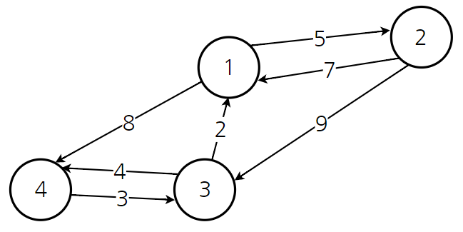

### Floyd Warshall

> '모든 정점'에서 '모든 정점'으로의 최단 경로를 구할 때 사용하는 알고리즘
>
> '거쳐가는 정점'을 기준으로 최단 거리를 구하는 것




위의 그래프가 존재할 때, 각각의 정점이 다른 정점으로 가는 비용을 이차원  배열의 형태로 출력

| 출/도 | 1    | 2    | 3    | 4    |
| ----- | ---- | ---- | ---- | ---- |
| 1     | 0    | 5    | 무한 | 8    |
| 2     | 7    | 0    | 9    | 무한 |
| 3     | 2    | 무한 | 0    | 4    |
| 4     | 무한 | 무한 | 3    | 0    |


- 노드 1을 거쳐가는 경우

| 출/도 | 1    | 2    | 3    | 4    |
| ----- | ---- | ---- | ---- | ---- |
| 1     | 0    | 5    | 무한 | 8    |
| 2     | 7    | 0    |      |      |
| 3     | 2    |      | 0    |      |
| 4     | 무한 |      |      | 0    |

노드 1을 거쳐가는 경우 위에 6가지 빈 공간만 갱신.

`X에서 Y로 가는 최소 비용 VS X에서 노드 1로 가는 비용 + 노드 1에서 Y로 가는 비용`

즉, 1를 거쳐서 가는 경우가 더 빠른 경우가 존재한다면 빠른 경우로 최소 비용을 계산

| 출/도 | 1    | 2    | 3    | 4    |
| ----- | ---- | ---- | ---- | ---- |
| 1     | 0    | 5    | 무한 | 8    |
| 2     | 7    | 0    | 9    | 15   |
| 3     | 2    | 7    | 0    | 4    |
| 4     | 무한 | 무한 | 3    | 0    |


- 노드 2를 거치는 경우

| 출/도 | 1    | 2    | 3    | 4    |
| ----- | ---- | ---- | ---- | ---- |
| 1     | 0    | 5    |      |      |
| 2     | 7    | 0    | 9    | 15   |
| 3     |      | 7    | 0    |      |
| 4     |      | 무한 |      | 0    |

위와 동일하게 처리

| 출/도 | 1    | 2    | 3    | 4    |
| ----- | ---- | ---- | ---- | ---- |
| 1     | 0    | 5    | 11   | 8    |
| 2     | 7    | 0    | 9    | 15   |
| 3     | 2    | 7    | 0    | 4    |
| 4     | 5    | 무한 | 3    | 0    |


- 같은 방식으로 노드 3과 노드 4에 대해서도 수행

| 출/도 | 1    | 2    | 3    | 4    |
| ----- | ---- | ---- | ---- | ---- |
| 1     | 0    | 5    | 11   | 8    |
| 2     | 7    | 0    | 9    | 13   |
| 3     | 2    | 7    | 0    | 4    |
| 4     | 5    | 10   | 3    | 0    |


- 소스코드

```python
import sys

n = 4
INF = sys.maxsize

# 자료 배열
matrix = [[0, 5, INF, 8],
         [7, 0, 9, INF],
         [2, INF, 0, 4],
         [INF, INF, 3, 0]]

# 결과 그래프
visited = [[0] * n for _ in range(n)]

for i in range(n):
    for j in range(n):
        visited[i][j] = matrix[i][j]

# k = 거쳐가는 노드
for k in range(n):
    # i = 출발 노드
    for i in range(n):
        # j = 도착 노드
        for j in range(n):
            # 바로가는 노드와 거쳐가는 노드 비교
            if matrix[i][k] + matrix[k][j] < matrix[i][j]:
                visited[i][j] = matrix[i][k] + matrix[k][j]

# 결과 출력
print(visited)

'''
[[0, 5, 11, 8], 
[7, 0, 9, 13], 
[2, 7, 0, 4], 
[5, 10, 3, 0]]
'''
```

