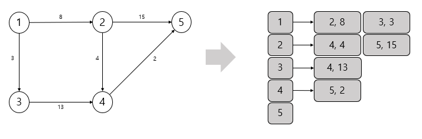
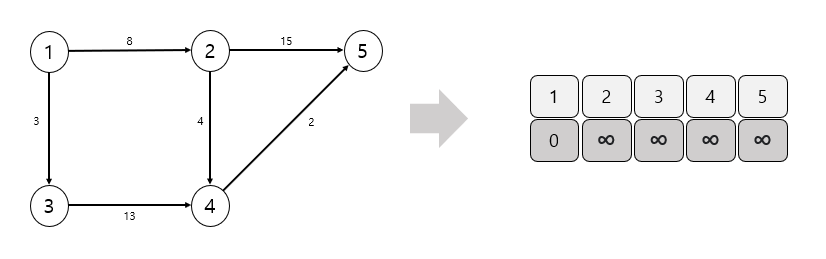

# 다익스트라

| 기능                                      | 특징             | 시잔복잠도(노드 수 : V / 에지 수 : E) |
| ----------------------------------------- | ---------------- | ------------------------------------- |
| 출발 노드와 모든 노드 간의 최단 거리 탐색 | 에지는 모두 양수 | O(ElogV)                              |

특정 노드에서 다른 노드들의 최단 거리를 구하는 문제가 주어졌을 때 다익스트라 알고리즘을 사용하면 문제를 해결할 수 있다.

### 다익스트라 핵심 이론

1. ##### 인접 리스트로 그래프 구현하기

2. ##### 최단 거리 리스트 초기화하기

3. ##### 값이 가장 작은 노드 고르기

4. ##### 최단 거리 리스트 업데이트 하기

   > 선택된 노드에 연결된 에지의 값을 바탕으로 다른 노드의 값을 업데이트 한다.
   >
   > 1단계에서 저장해 놓은 연결 리스트를 이용해 현재 선택된 노드의 에지들을  탐색하고 업데이트
   >
   > 연결 노드의 최단 거리는 두 값중 더 작은 값으로 업데이트

   - 최단 거리 업데이트 방법

     Min(선택 노드의 최단 거리 리스트의 값 + 에지 가중치, 연결 노드의 최단 거리 리스트의 값)

5. ##### 과정 3~4를 반복해 최단 거리 리스트 완성하기