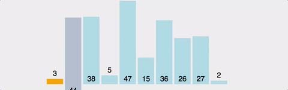

# 정렬

| 정렬 알고리즘 | 정의                                                         |
| ------------- | ------------------------------------------------------------ |
| 버블          | 데이터의 인접 요소끼리 비교하고, swap 연산을 수행하며 정렬하는 방식 |
| 선택          | 대상에[서 가장 크거나 작은 데이터를 찾아가 선택을 반복하면서 정렬하는 방식 |
| 삽입          | 대상을 선택해 정렬된 영역에서 선택 데이터의 적절한 위치를 찾아 삽입하면서 정렬하는 방식 |
| 퀵            | pivot 값을 선정해 해당 값을 기준으로 정렬하는 방식           |
| 병합          | 이미 정렬된 부분 집합들을 효율적으로 병합해 전체를 정렬하는 방식 |
| 기수          | 데이터의 자릿수를 바탕으로 비교해 데이터를 정렬하는 방식     |


### 버블정렬

##### 버블정렬의 핵심 이론

> 1. 버블 정렬은 두 인접한 데이터의 크기를 비교해 정렬하는 방법
> 2. 간단하게 구현할 순 있지만 시간 복잡도는 **O(n^2)**으로 다른 정렬 알고리즘보다 속도가 느린편
> 3. 루프를 돌면서 인접한 데이터 간의 swap 연산으로 정렬


##### 버블정렬 과정

1.  비교 연산이 필요한 루프 범위를 설정한다.
2. 인접한 데이터 값을 비교한다.
3. swap 조건에 부합하면 swap 연산을 수행한다.
4. 루프 범위가 끝날 때까지 2~3을 반복한다.
5. 정렬 영역을 설정한다. 다음 루프를 실행할 때는 이 영역을 제외한다.
6. 비교 대상이 없을 때까지 1~5를 반복한다.


##### 버블정렬 코드

```python
num = [1, 10, 5, 8, 7, 6, 4, 3, 2, 9]

for i in range(len(num)-1):
    for j in range(len(num)-1-i):
        if num[j]>num[j+1]:
            num[j], num[j+1] = num[j+1], num[j]
print(num)
```


##### 버블정렬 문제

- [수 정렬하기](https://www.acmicpc.net/problem/2750)

- [버블 소트](https://www.acmicpc.net/problem/1377)


---

### 선택정렬

##### 선택정렬 핵심 이론

>1. 최대나 최소 데이터를 데이터가 나열된 순으로 찾아가며 선택하는 방법
>
>2. 구현 방법이 복잡하고, 시간 복잡도도 **O(n^2)**으로 효율적이지 않음
>3. 최솟값 또는 최댓값을 찾고, 남은 정렬 부분의 가장 앞에 있는ㄷ ㅔ이터와  swap하는 것이 선택 정렬의 핵심


##### 선택정렬 과정

1. 남은 정렬 부분에서 최솟값 또는 최댓값을 찾는다
2. 남은 정렬 부분에서 가장 앞에 있는 데이터와 선택된 데이터를 swap한다.
3. 가장 앞에 있는 데이터의 위치를 변경해 남은 정렬 부분의 범위를 축소한다.
4. 전체 데이터의 크기만큼 index가 커질 때까지, 즉 남은 정렬 부분이 없을 때까지 반복한다.


##### 선택정렬 코드

```python
num = [1, 10, 5, 8, 7, 6, 4, 3, 2, 9]
for i in range(len(num)):
    min = i
    for j in range(i+1, len(num)):
        if num[min] > num[j]:
            min = j
	if num[i] > num[min]:
        num[i], num[min] = num[min], num[i]
```


##### 선택정렬 문제

- [소트인사이드](https://www.acmicpc.net/problem/1427)


---

### 삽입정렬

##### 삽입 정렬의 핵심 이론

> 1. 이미 정렬된 데이터 범위에 정렬되지 않은 데이터를 적절한 위치에 삽입키셔 정렬하는 방식
> 2. 시간복잡도는 **O(n^2)**으로 느린편이지만 구현하기 쉬움
> 3. 선택 데이터를 현재 정렬된 데이터 범위 내에서 적절한 위치에 삽입하는 것이 삽입 정렬의 핵심





##### 삽입 정렬 과정

1. 현재 index에 있는 데이터 값을 선택한다.
2. 현재 선택한 데이터가 정렬된 데이터 범위에 삽입될 위치를 탐색한다.
3. 삽입 위치부터 index에 있는 위치까지 shift 연산을 수행한다.
4. 삽입 위치에 현재 선택한 데이터를 삽입하고 index++ 연산을 수행한다.
5. 전체 데이터의 크기만큼 index가 커질 때까지, 즉 선택할 데이터가 없을 때까지 반복한다.


##### 삽입 정렬 코드

```python
num = [1, 10, 5, 8, 7, 6, 4, 3, 2, 9]

for i in range(len(num) - 1):
    # 인덱스에서 오름차순으로 선택
    
    for j in range(i, -1, -1):
        # 현재 선택한 데이터를 배열속에서 역방향으로 비교
        
        if num[j] > num[j + 1]:
            num[j], num[j + 1] = num[j + 1], num[j]

print(num)    
```

