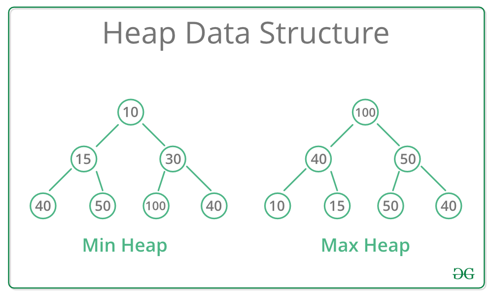

# 힙

> 힙은 특정한 규칙을 가지는 트리로, 최댓값과 최솟값을 찾는 연산을 빠르게 하기 위해 고안된 완전이진트리를 기본으로 한다.

힙 property : A가 B의 부모노드이면 A의 키값과 B의 키값 사이에는 대소 관계가 성립한다.

- 최소 힙 : 부모 노드의 키값이 자식 노드의 키값보다 항상 작은 힙
- 최대 힙 : 부모 노드의 키값이 자식 노드의 키값보다 항상 큰 힙



이러한 속성으로 인해 힙에서는 가장 낮은(혹은 높은) 우선순위를 가지는 노드가 항상 루트에 오게 되고 이를 이용해 우선순위 큐와 같은 추상적으로 자료형을 구현할 수 있다.

이때 키값의 대소 관계는 부모/자식 간에만 성립하고, 형제노드 사이에는 대소 관계까 정해지지 않는다.


### 파이썬 힙 자료구조

파이썬 heapq 모듈은 heapq(priority queue) 알고리즘을 제공한다.

모든 부모 노드는 그의 자식 노드보다 값이 작거나 큰 이진트리 구조인데, 내부적으로는 인덱스 -에서 시작해 k번째 원소가 항상 자식 원소들(2k+1, 2k+2) 보다 작거나 같은 최소 힙의 형태로 정렬된다.

heapq는 내장 모듈로 별도의 설치 작업 없이 바로 사용할 수 있다.


### 힙 함수 활용하기

- heapq.heappush(heap, item) : item을 heap에 추가
- heapq.heappop : heap에서 가장 작은 원소를 pop & 리턴. 비어 있는 경우 IndexError가 호출됨. 
- heapq.heapify(x) : 리스트 x를 즉각적으로 heap으로 변환함 (in linear time, *O(N)* )


### 힙 생성 & 원소 추가

```python
import heapq

heap = []
heapq.heappush(heap, 50)
heapq.heappush(heap, 10)
heapq.heappush(heap, 20)
print(heap)
'''
[10, 50, 20]
'''

heap2=[50, 10, 20]
heapq.heapify(heap2)
print(heap2)
'''
[10, 50, 20]
'''


# 삭제
result = heapq.heappop(heap)
print(result)
print(heap)
'''
10
[20, 50]
'''
```

